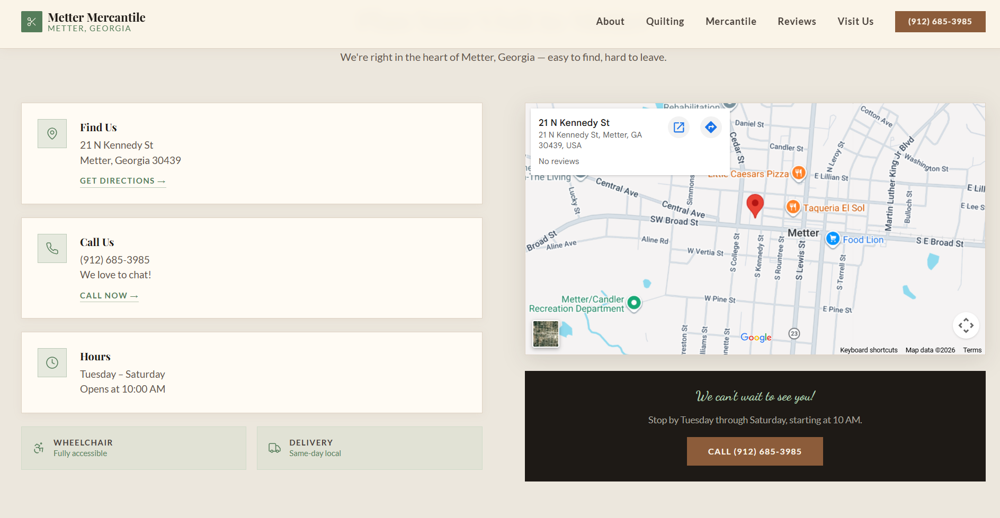

## ✏️ [Live Demo](https://mettershop-ftddyyue.manus.space/)  

## ✨ Features

-   🎯 **Modular Monorepo Architecture:** Organized codebase with dedicated `client`, `server`, and `shared` workspaces for enhanced development workflow.
-   ⚛️ **Modern Frontend Experience:** Built with React and Vite for a fast, responsive, and interactive user interface.
-   ⚡ **Optimized Development Workflow:** Leverages Vite for lightning-fast HMR and build times, significantly boosting developer productivity.
-   🔄 **Efficient Dependency Management:** Uses pnpm workspaces for deterministic and efficient package management.
-   ⚙️ **Shared Utilities & Types:** Common interfaces, types, and utility functions are centralized in the `shared` directory, ensuring consistency across client and server.

## 🖥️ Screenshots




## 🛠️ Tech Stack

**Frontend:**


**Backend:**


**Tools & Package Management:**


## 🚀 Quick Start

Follow these steps to get your development environment up and running.

### Prerequisites
Make sure you have the following installed:
-   **Node.js** (LTS version recommended, e.g., v18.x or v20.x)
-   **pnpm** (preferred package manager for this monorepo)
    ```bash
    npm install -g pnpm
    ```
-   **Git**

### Installation

1.  **Clone the repository**
    ```bash
    git clone https://github.com/is4r0/metter-mercantile.git
    cd metter-mercantile
    ```

2.  **Install dependencies**
    This project uses `pnpm` workspaces. Run the install command from the root directory to install dependencies for all client, server, and shared projects.
    ```bash
    pnpm install
    ```

3.  **Environment setup**
    Create `.env` files for both client and server based on their respective examples (if present). If not, infer required variables.
    ```bash
    # Example for client (adjust path if needed)
    cp client/.env.example client/.env

    # Example for server (adjust path if needed)
    cp server/.env.example server/.env
    ```
    **Configure your environment variables:**
    <!-- TODO: List actual environment variables detected from .env.example or code usage in client/server -->
    -   `VITE_API_BASE_URL` (for client to connect to backend)
    -   `PORT` (for server to listen on)
    -   `DATABASE_URL` (if a database is used)
    -   `JWT_SECRET` (if authentication is implemented)

4.  **Database setup** (if applicable)
    <!-- TODO: Add specific database setup commands if a database and migrations are detected (e.g., Prisma, TypeORM, Mongoose) -->
    If your project utilizes a database, you might need to:
    -   Start your database service (e.g., Docker container for PostgreSQL).
    -   Run migration commands:
        ```bash
        # Example: pnpm --filter server run db:migrate
        ```
    -   Seed the database with initial data:
        ```bash
        # Example: pnpm --filter server run db:seed
        ```

5.  **Start development servers**
    This monorepo might have separate or combined start commands.
    ```bash
    # To start the client application
    pnpm --filter client dev

    # To start the backend server (if a dedicated script exists)
    pnpm --filter server dev # Or 'pnpm --filter server start'
    ```
    *Note: You might need to run these commands in separate terminal tabs.*

6.  **Open your browser**
    Visit `http://localhost:[detected client port, typically 5173]`

## 📁 Project Structure

```
metter-mercantile/
├── .gitkeep              # Placeholder for an empty directory
├── .gitignore            # Specifies intentionally untracked files to ignore
├── .prettierignore       # Files ignored by Prettier for formatting
├── .prettierrc           # Configuration file for Prettier code formatter
├── client/               # Frontend application (React + Vite)
│   ├── public/           # Static assets
│   ├── src/              # Source code for the client application
│   │   ├── components/   # Reusable UI components
│   │   ├── pages/        # Main application pages/routes
│   │   ├── assets/       # Images, icons, etc.
│   │   └── main.tsx      # Client entry point
│   ├── index.html        # HTML entry point
│   ├── package.json      # Client-specific dependencies and scripts
│   └── tsconfig.json     # TypeScript configuration for the client
├── components.json       # Configuration for Shadcn UI components
├── package.json          # Root package.json for monorepo configuration and scripts
├── patches/              # Directory for pnpm patches
├── pnpm-lock.yaml        # pnpm lock file for deterministic dependency resolution
├── server/               # Backend application (Node.js + TypeScript)
│   ├── src/              # Source code for the server
│   │   ├── controllers/  # API route handlers
│   │   ├── models/       # Database models/schemas
│   │   ├── routes/       # API route definitions
│   │   └── index.ts      # Server entry point
│   ├── package.json      # Server-specific dependencies and scripts
│   └── tsconfig.json     # TypeScript configuration for the server
├── shared/               # Shared code (interfaces, types, utility functions)
│   ├── src/              # Source code for shared modules
│   │   └── types/        # Common TypeScript types and interfaces
│   └── package.json      # Shared-specific dependencies and scripts
├── tsconfig.json         # Base TypeScript configuration for the monorepo
├── tsconfig.node.json    # TypeScript configuration specific to Node.js environments (e.g., server)
└── vite.config.ts        # Vite configuration file (likely for the client build)
```


## 🤝 Contributing

We welcome contributions to Metter Mercantile! To contribute, please follow these steps:

1.  Fork the repository.
2.  Create a new branch for your feature or bug fix.
3.  Make your changes and ensure they adhere to the project's coding standards.
4.  Write clear, concise commit messages.
5.  Push your changes to your fork.
6.  Open a pull request to the `main` branch of this repository.

---

<div align="center">

**⭐ Star this repo if you find it helpful!**

Made with ❤️ by [is4r0]

</div>

